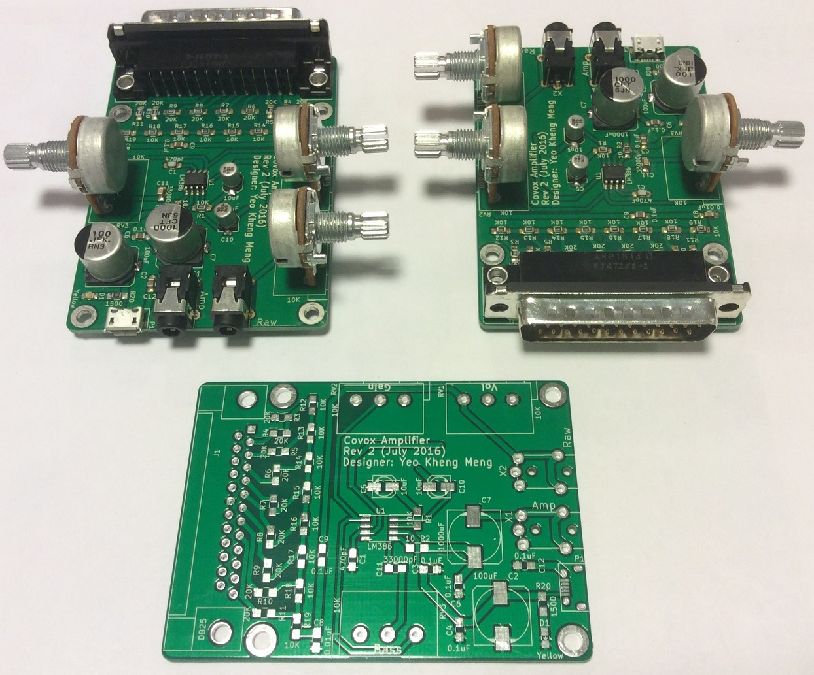
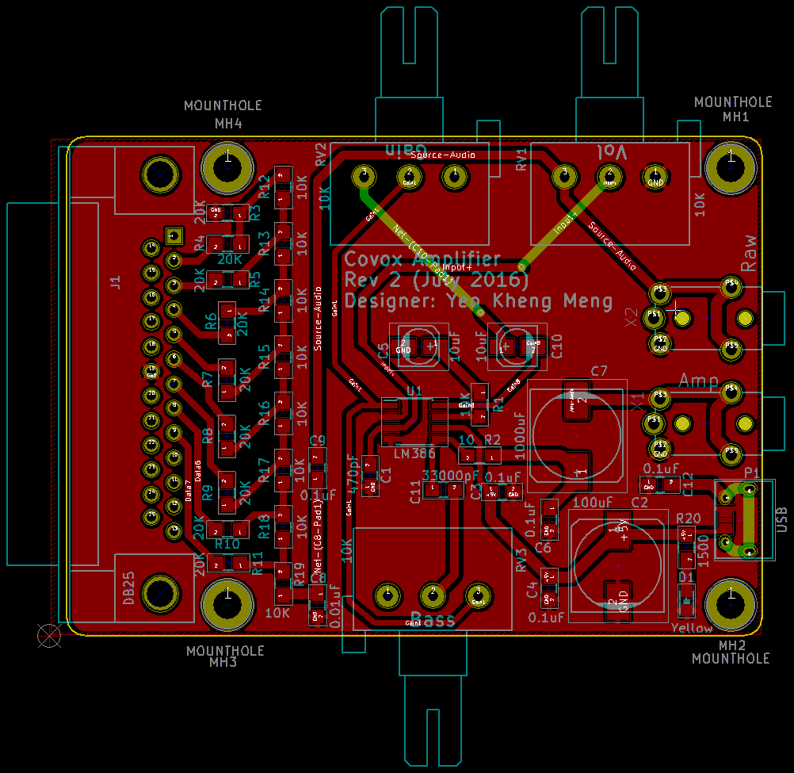
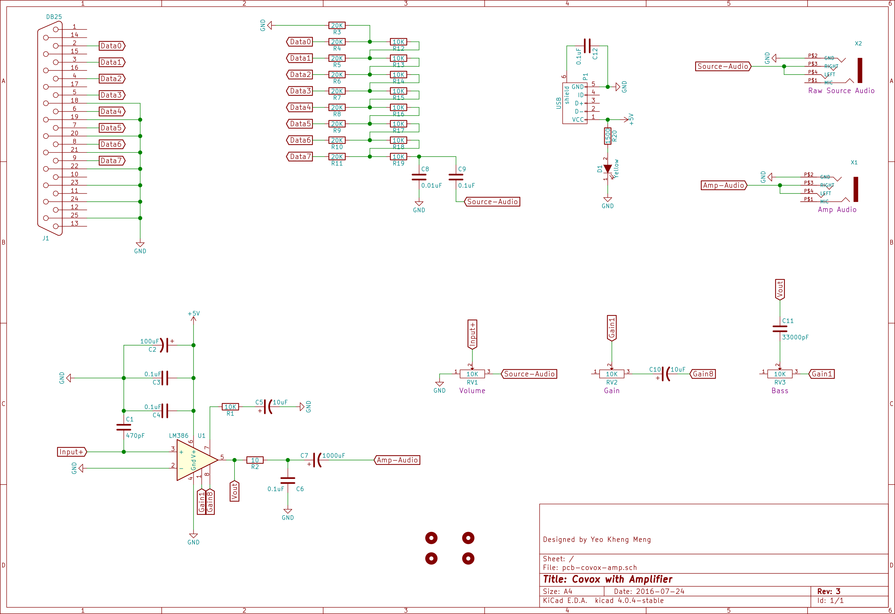

# pcb-covox-amp
A tiny sound card based on the Covox Speech Thing design which includes an amplifier.

##PCB Design software and addons used

1. Kicad 4.0.2 but later versions should work

##Images

##Schematic drawings

##Parts required
Use Libreoffice to open [pcb-covox-amp-bom.ods](pcb-covox-amp-bom.ods)

##References
1. [Hardware implementation references](https://blog.frantovo.cz/c/307/DAC%20%28zvukov%C3%A1%20karta%29%20pro%20LPT%20port%20a.k.a.%20Covox)
2. [Design reference](http://kb.gr8bit.ru/KB0010/GR8BIT-KB0010-Adding-multimedia-capability-covox-device.html)
3. [MJ-2135 package referenced from coqui-dip](https://github.com/open-eie/coqui-dip)
4. [Amplifier circuit](http://www.circuitbasics.com/build-a-great-sounding-audio-amplifier-with-bass-boost-from-the-lm386/)
